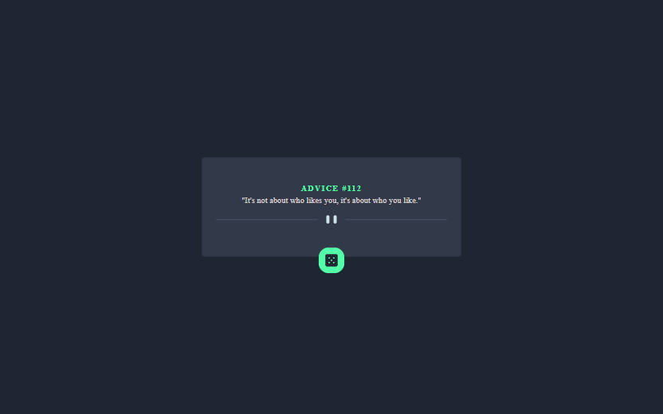

# advice-quote
# Frontend Mentor - Advice generator app solution

This is a solution to the [Advice generator app challenge on Frontend Mentor](https://www.frontendmentor.io/challenges/advice-generator-app-QdUG-13db). Frontend Mentor challenges help you improve your coding skills by building realistic projects.

## Table of contents

- [Overview](#overview)
  - [The challenge](#the-challenge)
  - [Screenshot](#screenshot)
  - [Links](#links)
  - [Built with](#built-with)
  - [What I learned](#what-i-learned)
- [Author](#author)

## Overview

### The challenge

Users should be able to:

1. View the optimal layout for the app depending on their device's screen size
2. See hover states for all interactive elements on the page
3. Generate a new piece of advice by clicking the dice icon

### Screenshot

### Links

- Solution URL:(https://github.com/ibimina/advise-slip-rect)
- Live Site URL: (https://ibimina.github.io/advise-slip-rect/)

### Built with

- Reactjs
- CSS custom properties
- Flexbox
- Mobile-first workflow

### What I learned

How to fetch data using api

## Author

- Ibimina Hart
- Frontend Mentor -(https://www.frontendmentor.io/profile/ibimina)

